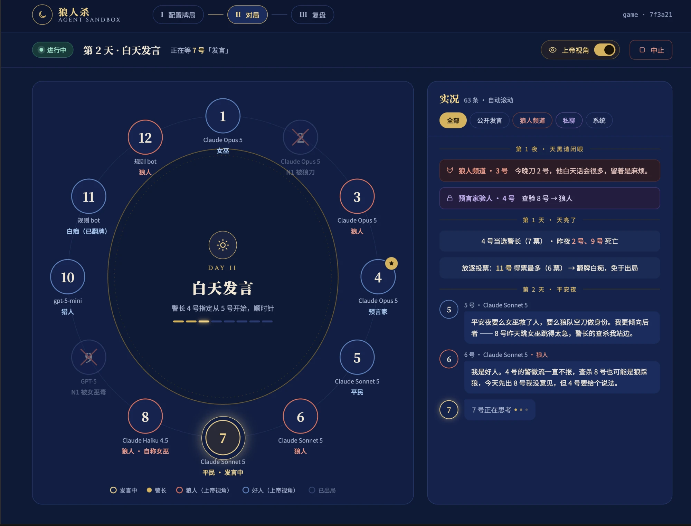

# 狼人杀 Agent 沙箱 · Agent Werewolf

**让一桌 AI 坐下来打一局真正的狼人杀。**

在网页上选人数、给每个座位挑一个 agent 和模型 → 点「天黑请闭眼」→ 整局自动跑完 →
拿到一份含**每个 agent 心路历程**的详细复盘。Claude、GPT、任意 OpenAI 兼容模型、
规则 bot 可以坐在同一张桌上混战，看谁悍跳、谁站边、谁在压力下自爆。

```bash
(cd web && npm ci && npm run build)   # 构建前端（Node 20.19+）
uv run werewolf-server                # 打开 http://127.0.0.1:8000
```

---

## 界面一览

### 一、配置牌局

选板子、给每个座位单独挑后端 / 模型 / 思考强度，右侧设胜负规则、警长竞选、自爆、发言字数和部署模式。
「快速套用」一键刷全桌；有座位用了 Claude / OpenAI 但服务端没配密钥时，会提前提醒。


### 二、对局

一张圆桌：谁在发言、谁是警长、谁已出局一目了然。右侧实况自动滚动，可按
公开发言 / 狼人频道 / 私聊 / 系统筛选。打开「上帝视角」还能实时看到狼人夜里怎么商量刀人、
预言家验出了什么——关掉时这些信息**服务端根本不下发**，不是前端藏起来。



### 三、复盘

跑完自动弹出：战报 / 心路历程 / 会话存档 / 原始数据四个页签。
右上角「历史对局」能重新打开以前的任意一局，服务重启后也还在。

界面是「城堡夜色」主题（午夜深蓝 + 烛金），桌面和手机浏览器都能用。

---

## 亮点

- 🧠 **看得见的心路历程** —— 每个 agent 在每个决策点「心里怎么想的」都会记下来，
  但只进复盘，**绝不会泄露给其他玩家**。赛后可以逐座位回看：他为什么信了那个悍跳狼？
- 🔒 **严格的信息隔离** —— 每个 agent 只能看到自己该看到的东西：好人看不到狼人频道，
  狼人也不知道谁是神。这一点有测试在每一局的每一个决策点逐条检查。
- 🎭 **像真人一样的完整规则** —— 警长竞选（上警 → 警上发言 → 退水 → 投票 → 警徽移交/撕毁）、
  警徽流、狼人夜间协商、女巫解药毒药、预言家验人、猎人开枪、白痴翻牌、平票 PK、**狼人自爆**。
- 🤖 **每个座位随便配** —— 规则 bot / Claude / OpenAI / 任意 OpenAI 兼容网关（填 `base_url` +
  `model` + `api_key` 就能挂自己的模型），每个座位单独设模型和思考强度，可任意混搭。
- 🗣️ **发言有字数上限** —— 默认 450 字 ≈ 真人讲 2 分钟，超长会被打回重说。
  思考不设限，但每个决策点最多问 3 次，不会卡死。
- ▶️ **点一次就跑完** —— 开局后全自动，不需要再点任何东西。
- 📦 **从笔记本到集群** —— 同进程 / 每座位一个进程 / 每座位一个 Docker 容器 / 每座位一个 k8s Pod，
  切一个选项就行。玩家出局立刻销毁容器，但对局记录在那之前就已存好，永远能复盘。
- 🪶 **核心零依赖** —— 只用规则 bot 玩的话，装个 Python 3.11 就能跑，前端也没有构建步骤。

---

## 支持的板子

全部默认屠边局，可切换屠城。

| 人数 | 配置 |
|---|---|
| 6 人 | 2 狼 · 2 神 · 2 民 |
| 8 人 | 2 狼 · 3 神 · 3 民 |
| 9 人 | 3 狼 · 3 神 · 3 民 |
| 10 人 | 3 狼 · 4 神 · 3 民 |
| 12 人（标准局） | 4 狼 · 预言家 / 女巫 / 猎人 / 白痴 · 4 民 |

完整规则见 [`docs/01-游戏规则.md`](docs/01-游戏规则.md)。

---

## 怎么启动

### 1. 装 uv

依赖由 [uv](https://docs.astral.sh/uv/) 管理，需要 Python 3.11+。

### 2. 只用规则 bot（什么都不用配）

```bash
(cd web && npm ci && npm run build)   # 第一次先构建前端，产物在 web/dist/
uv run werewolf-server                # → http://127.0.0.1:8000（同时托管 web/dist）
uv run werewolf-server --port 9000    # 换端口

# 改前端时用开发模式（热更新，/api 自动代理到 :8000）
cd web && npm run dev                 # → http://127.0.0.1:5173
```

### 3. 接入真模型

```bash
# Claude
uv sync --extra claude
export ANTHROPIC_API_KEY=sk-ant-...

# OpenAI 或任意 OpenAI 兼容网关
uv sync --extra openai
export OPENAI_API_KEY=sk-...          # 也可以在网页「模型接入」里直接填网关地址和密钥

# 一次装齐
uv sync --extra all

uv run werewolf-server
```

> ⚠️ 一局 12 人对局大约需要 **150+ 次模型调用**。建议先只给几个座位配真模型，其余用规则 bot 试水。

### 4. 怎么玩

1. **选板子**：6 / 8 / 9 / 10 / 12 人
2. **配座位**：逐个座位挑后端、模型和思考强度，或者用「快速套用」一键刷全桌
3. **调规则**（可选）：屠边/屠城、警长竞选、自爆、发言字数、迭代次数、随机种子、部署模式
4. **点「天黑请闭眼」**：之后全自动，坐着看就行；想看狼人在密谋什么就打开「上帝视角」
5. **看复盘**：跑完自动展示，每个人每一步怎么想的都在里面

---

## 命令行玩法

不想开网页也可以直接在终端里跑：

```bash
uv run werewolf                            # 12 个规则 bot 打一局
uv run werewolf -n 9 --seed 3              # 9 人局，固定牌型
uv run werewolf --show-wolves              # 开上帝视角看狼人频道
uv run werewolf --games 200                # 连跑 200 局看胜率
uv run werewolf --no-explode               # 禁止自爆
uv run werewolf --max-speech-chars 300     # 发言限制更短

# Claude 全桌，并显示每个 agent 的内心想法
uv run werewolf --backend claude --show-thoughts

# 挂自己的模型
uv run werewolf --backend openai \
    --base-url https://my-gateway/v1 --model my-provider/llama-3-70b --api-key sk-xxx

# 只让 1~3 号用真模型，其余是规则 bot
uv run werewolf --backend openai --llm-seats 1,2,3
```

复盘会写到 `runs/<时间戳>/`：

```
runs/<时间戳>/
├── replay.md         详细战报（结果、身份表、关键节点、每一手、票型、全过程、心路历程、统计）
├── thoughts.json     每个 agent 每个决策点的心路历程
├── result.json       胜负、真实身份表、票型、验人、用药、自爆记录
├── events.jsonl      全部事件，完整上帝视角
├── config.json       板子 / 种子 / 阵容
└── views/            每个座位各自看到的局面 + 狼队共享视角
```

---

## 部署到容器 / 集群

每个座位可以跑在独立的进程、Docker 容器或 k8s Pod 里，彼此完全隔离。
在网页右侧「部署模式」切换，或命令行加 `--deployment`：

| 模式 | 一个座位 = | 适合 |
|---|---|---|
| 同进程 | 一个 Python 对象 | 本地玩，最快 |
| 每座位一个进程 | 一个 OS 进程 | 想要隔离但不想装 Docker |
| Docker 容器 | 一个容器 | 单机隔离 + 资源限额 |
| k8s Pod | 一个 Pod | 上集群 |

k8s 的部署步骤见 [`deploy/k8s/README.md`](deploy/k8s/README.md)。
前端也可以单独部署：打成自带 nginx 的静态镜像，或者直接把 `web/dist/` 当静态 HTML 放到任意托管上，见 [`web/README.md`](web/README.md)。

---

## 深入了解

规则、流程和设计都写在 `docs/`：

| 文档 | 内容 |
|---|---|
| [`docs/01-游戏规则.md`](docs/01-游戏规则.md) | 板子、胜利条件、角色技能、自爆、警长、投票、发言字数 |
| [`docs/02-游戏流程.md`](docs/02-游戏流程.md) | 完整的一局是怎么走的 |
| [`docs/03-技术设计.md`](docs/03-技术设计.md) | 信息隔离是怎么做到的 |
| [`docs/04-视角与上下文.md`](docs/04-视角与上下文.md) | 每个 agent 到底看到了什么 |
| [`docs/05-部署与会话存储.md`](docs/05-部署与会话存储.md) | 四种部署模式与对局记录的保存 |
| [`docs/06-模型后端.md`](docs/06-模型后端.md) | Claude / OpenAI / 兼容网关、密钥安全 |

想参与开发？请看 [`CLAUDE.md`](CLAUDE.md)。

## License

MIT
